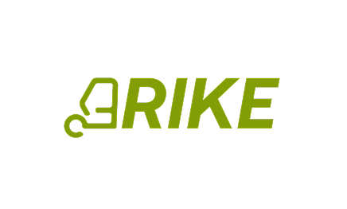

<div align="center">



### Own a piece of the electric tricycles moving Africa — and earn from them.

*Real-world asset ownership, on-chain — built for Africa, starting with Nigeria.*

**Built on Robinhood Chain** · Solidity · Node.js · React

[Live API](https://3rike-mobility-hood.up.railway.app/health) · [Smart Contracts](#-smart-contracts) · [Demo Video](#-demo)

</div>

---

## 🌍 The Problem

Across Africa, electric tricycles ("keke") move millions of people every day — but the drivers rarely **own** them.

- **Drivers** rent the very vehicles that feed their families. They pay weekly, forever, and at the end they own **nothing** — no asset, no equity, no credit history.
- **Everyday people** have no way to invest in the real, income-generating vehicles on their streets. Productive local assets stay locked away from the people closest to them.
- **Financing is broken.** Riders have no formal credit identity, so they can't access fair loans to grow.

The capital that powers African mobility is invisible, informal, and excludes the very people who drive it.

## 💡 The Solution

**3rike turns each electric tricycle into a shared, on-chain asset.**

- Anyone can **invest** in a real tricycle — buying fractional shares from as little as **$20**.
- A **driver** is matched to that tricycle and pays it off weekly toward full ownership.
- Every payment **automatically** routes a slice to the investors who backed it — split fairly, pro-rata, on-chain.
- Each payment builds the driver a **real credit score**, which unlocks **collateral-free loans** that grow with their track record.

Drivers gain ownership and a financial identity. Investors earn yield from a real vehicle on a real road. **One engine, two sides — the 3rike loop.**

---

## ✨ Key Features

| Feature | What it does |
|---|---|
| 🔐 **Embedded wallet** | A secure EVM wallet is created automatically on signup — no seed phrases. |
| 🌍 **USD ↔ Naira** | Hold a stable digital dollar; view your balance in local Naira with one tap (live FX). |
| 💸 **Deposit / Withdraw** | On/off-ramp via crypto **and** Nigerian bank (Naira) through a treasury bridge. |
| 🚖 **Fractional investment** | Buy shares of real tricycles (ERC-1155), track your portfolio, and claim on-chain yield. |
| 🪪 **Verification + credit score** | KYC unlocks a live, explainable credit score built from real behavior (deposits, investing, on-time payments). |
| 💳 **Micro-loans** | Credit-gated, collateral-free loans disbursed to your wallet; on-time repayment grows your score & limit. |
| 🔁 **Rider payments → auto-yield** | A driver's weekly payment debits their wallet, auto-distributes a yield slice to that tricycle's investors, and advances their ownership %. |

---

## 🔁 How the Loop Works

```
        invests $$ (buys shares)                pays weekly
 ┌──────────────┐  ───────────────►  ┌───────────────┐  ───────────────►  ┌──────────────┐
 │  INVESTORS   │                    │  TRICYCLE NFT  │                    │    DRIVER    │
 │ (ERC-1155    │  ◄───────────────  │  + share pool  │  ◄───────────────  │  pays it off │
 │  shareholders)│   pro-rata yield  └───────────────┘   ownership % up    └──────────────┘
 └──────────────┘   (auto, on-chain)                     + credit score up
```

When a driver pays, the platform calls `distributeYield` on-chain: USDC is split across all shareholders of *that* tricycle by exactly how many shares each holds. Investors claim it straight to their wallet.

---

## 🛠 Tech Stack

| Layer | Stack |
|---|---|
| **Smart contracts** | Solidity 0.8.24 · Foundry · OpenZeppelin (ERC-721 / ERC-1155 / ERC-4626) |
| **Backend** | Node.js · TypeScript · Express · Prisma · PostgreSQL · viem |
| **Frontend** | React 19 · Vite · TypeScript · Tailwind CSS v4 |
| **Chain** | Robinhood Chain testnet (EVM, Arbitrum Orbit L2) — chain ID `46630` |
| **Rails** | USDC · Paycrest (Naira ⇄ stablecoin) · custodial gas-sponsored wallets |
| **Hosting** | Backend on Railway · Frontend on Vercel |

---

## 📜 Smart Contracts

Deployed to **Robinhood Chain testnet** (chain ID `46630`). Explorer: `https://explorer.testnet.chain.robinhood.com`

| Contract | Purpose | Address |
|---|---|---|
| **FractionalInvestment** | ERC-1155 fractional ownership + accumulator-based on-chain yield | `0xBBE7ECa80d91e26E24A9f498B15239a5D975542B` |
| **TricycleNFT** | ERC-721 — one NFT per real-world tricycle (the asset) | `0x64b84997414F7Bb301B5e6A2E228066e27C7EDd0` |
| **ThreeRikeVault** | ERC-4626 USDC yield vault | `0x34979dF7570697feB152468C3A17a51d0B9a34ED` |
| **USDC** | Stablecoin used across the app (6 decimals) | `0x5B6C7cAF7F99f99154fD8375ec935Fcf03F326f5` |

> All contract tests pass (`forge test`). The yield accumulator distributes O(1) regardless of investor count, and share transfers carry future yield (not past).

---

## 📂 Project Structure

```
3rike-Mobility/
├── contracts/        # Foundry — TricycleNFT, FractionalInvestment, ThreeRikeVault (+ tests, deploy scripts)
├── backend/          # Node/Express API — auth, wallet, investment, KYC, credit, loans, rider payments, Paycrest
│   ├── src/lib/      #   chain + investment + paycrest helpers, ABIs
│   ├── src/services/ #   domain logic (investment, credit, loan, rider, wallet)
│   ├── src/routes/   #   thin HTTP routes
│   └── prisma/       #   schema (Postgres)
├── 3rike-frontend/   # React + Vite app (driver + investor flows)
└── DEPLOY.md         # Railway + Vercel deployment guide
```

---

## 🚀 Getting Started

**Prerequisites:** Node 20+, a Postgres database, and [Foundry](https://book.getfoundry.sh/) for contracts.

```bash
# 1. Contracts
cd contracts && ./setup.sh && forge build && forge test

# 2. Backend  (copy backend/.env.example → backend/.env and fill it in)
cd backend && npm install
npx prisma generate && npx prisma db push
npm run dev                      # http://localhost:8080

# 3. Frontend (copy 3rike-frontend/.env.example → .env, set VITE_API_URL)
cd 3rike-frontend && npm install
npm run dev                      # http://localhost:5173
```

Environment variables are documented in `backend/.env.example` and `3rike-frontend/.env.example`. See **[DEPLOY.md](./DEPLOY.md)** for hosting on Railway + Vercel.

> ⚠️ The platform relayer wallet sponsors gas for all on-chain actions — keep it funded with testnet ETH (faucet: `https://faucet.testnet.chain.robinhood.com`).

---

## 🎬 Demo

- **Demo video:** *(add your YouTube link)*
- **Live app:** *(add your Vercel link)*
- **API health:** https://3rike-mobility-hood.up.railway.app/health

---

## 🗺 Roadmap

- [x] Embedded wallets + crypto deposit/withdraw
- [x] Naira bank deposit/withdraw (Paycrest treasury bridge)
- [x] USD ↔ Naira balance
- [x] Fractional investment + on-chain yield + portfolio
- [x] KYC verification + explainable credit score
- [x] Credit-gated micro-loans
- [x] Rider weekly payments → automatic investor yield
- [ ] Savings / yield-vault product
- [ ] Migrate from testnet bridge to full mainnet USDC
- [ ] Fleet onboarding + driver matching at scale

---

## 📄 License

MIT
